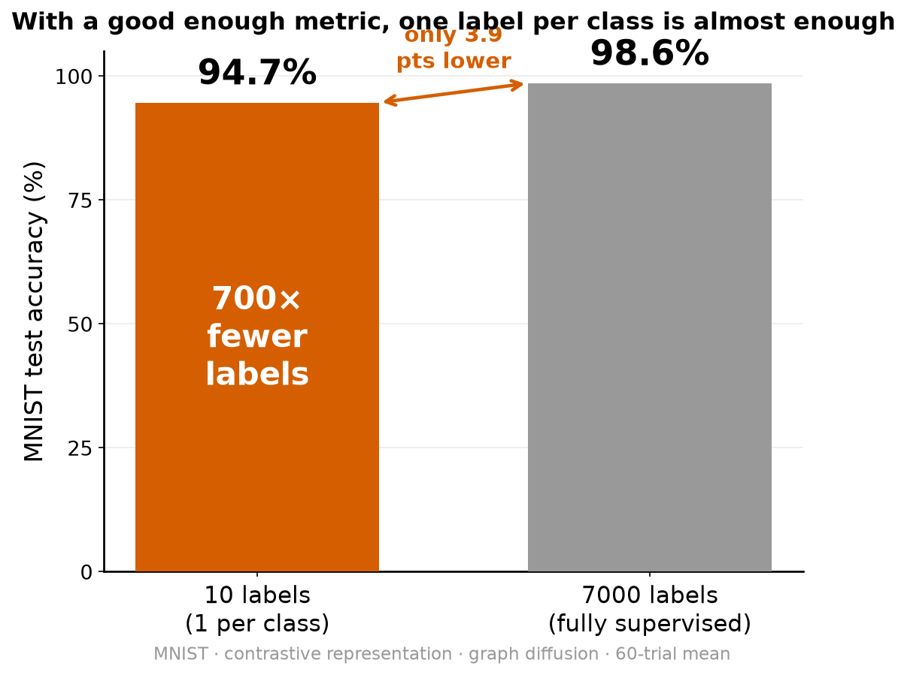
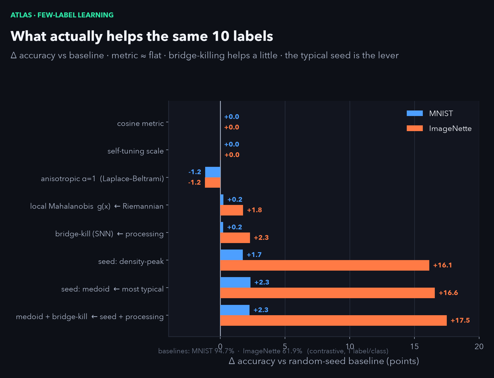

<p align="center"></p>

# atlas

> **few-label learning on a manifold** — *(Türkçe: [README.tr.md](README.tr.md))*

**One label per class classifies MNIST at 94.7%.** Not because the labels are clever — because the label was never the hard part. Give a good representation to a plain graph-diffusion rule and ten labels do the work of seven thousand. Swap in a bad representation and the *exact same rule* collapses to 71%.

<p align="center"></p>

The whole 23-point spread is the **metric** — how you decide which points are "near". The label only puts a name on a cluster the geometry already found. This repo makes that precise, measurable, and shows exactly where it breaks.

<p align="center"></p>
<p align="center"><em>Two labelled points (stars). Colour flows along the graph, filling each moon — never across the gap.</em></p>

### In plain words

You have thousands of images and can label only a handful. Instead of *training a classifier*, you (1) turn each image into a feature vector with an **unsupervised** encoder, (2) connect each image to its nearest neighbours in that feature space to form a graph, and (3) drop **one labelled seed per class** and let each label **spread along the graph edges** until every node is coloured. It works astonishingly well — *if* neighbours in feature space really are the same class. That one condition, **edge purity**, decides everything, and it is set entirely by the encoder. So the real question is never "how do we use the labels" — it is "how good is the metric."

**Contents:** [Three claims](#three-claims-each-measured) · [Why it works](#why-it-works) · [Use it](#use-it) · [The math](#the-mechanism--the-math) · [Phase transition](#the-catch-that-makes-it-real-a-phase-transition) · [Label budget](#how-many-labels-does-a-dataset-actually-need) · [The map](#ten-labels-drawn-on-the-map) · [MNIST results](#results-on-mnist) · [ImageNette](#does-it-hold-on-real-photographs--imagenette) · [Squeezing more](#squeezing-more--a-better-ruler-or-a-better-chosen-label) · [What this is](#what-this-is)

---

## Three claims, each measured

1. **The metric is the whole game.** Same 10 labels, same algorithm: raw pixels → 71%, a learned contrastive metric → **94.7%** (fully-supervised ceiling: 98.6%). The classifier didn't change; the geometry did.
2. **Labels count modes, not classes.** Once the geometry has grouped the data, a label is just a *name* for a group. You need roughly one label per **mode**, and a class is a union of modes — so the label budget tracks the data's shape, not its number of categories.
3. **It's a phase transition, not a trade-off.** There is a sharp edge-purity threshold. Above it, one label floods its cluster correctly. Below it, propagating labels is *actively worse than doing nothing*. This is the load-bearing fact, not a footnote.

---

## Why it works

**A distance is only as honest as the space it lives in.** In raw pixel space two photos count as "close" when they share colour and layout — so a gas pump lands next to a golf ball, a church, a parachute. Nearest-neighbour on that metric is wrong almost everywhere. Learn an unsupervised embedding first and "close" starts to mean *the same thing*.

<p align="center"></p>
<p align="center"><em>One real ImageNette photo and its 8 nearest neighbours, in two vector spaces. Raw pixels: every neighbour is a different class (0/8). The learned 512-D embedding: every neighbour is the same class (8/8). Same photo, same k — only the space changed. Across all 3,925 images, same-class neighbours climb from 21% to 77%.</em></p>

**A graph turns a good metric into labels.** Connect each point to its k nearest neighbours and let a label *flow along the edges* instead of jumping in a straight line. Now "near" means *reachable along the data*. From one seed per class, that flow paints the whole dataset — as long as edges mostly connect same-class points. The single number that decides everything is **edge purity**, and edge purity is a property of the representation, not the classifier.

---

## Use it

```bash
git clone https://github.com/cleoanka/atlas && cd atlas
pip install -r requirements.txt

python src/evaluate.py                        # MNIST table   -> results/results.json
python src/sweep.py                           # MNIST sweep   -> results/sweep.json
python figures/make_figures.py                # regenerate every MNIST figure + the cover GIF

python src/evaluate.py --dataset imagenette   # ImageNette table
python src/sweep.py    --dataset imagenette
python figures/make_imagenette_figures.py     # regenerate the ImageNette figures
```

Everything reproduces **without a GPU**: the trained embeddings (`contrastive_emb.npz`, `data/imagenette_emb.npz`) ship in the repo; the raw datasets download themselves only if you retrain. To retrain an encoder yourself: `pip install torch` then `python src/train_contrastive.py 40` (MNIST) or `python src/train_contrastive_imagenette.py --epochs 300 --img 160 --batch 512` (ImageNette; device auto: MPS / CUDA / CPU, mixed-precision on CUDA, `--backbone resnet50` for more capacity).

**Train on a free GPU in the browser** — no setup, T4 (16 GB): [](https://colab.research.google.com/github/cleoanka/atlas/blob/main/notebooks/train_colab.ipynb) &nbsp; Full Mac (MPS) & NVIDIA (CUDA, incl. RTX 50-series) setup — installs, VRAM guidance, recommended configs — is in [`docs/TRAINING.md`](docs/TRAINING.md). A 5-cell walk-through of the idea is in [`notebooks/demo.ipynb`](notebooks/demo.ipynb).

**Layout.** `src/` — representations, the metric protocol (`metrics.py`), evaluation, sweep, trainers. `figures/` — one `make_figN_*.py` per figure (`make_figures.py` runs all). `results/` — the JSON numbers (source of truth). `notebooks/demo.ipynb` — the idea in five cells.

---

## The mechanism — the math

**The graph.** Embed each of the $n$ points with a representation $\phi$, join every point to its $k$ nearest neighbours, weight each edge by a Gaussian kernel, symmetrise ($W=W^{\top}$), and normalise with the degree matrix $D=\mathrm{diag}(\sum_j W_{ij})$:

$$W_{ij} = \exp\!\left(-\frac{\lVert \phi_i-\phi_j\rVert^2}{2\sigma^2}\right),\qquad S = D^{-1/2}\,W\,D^{-1/2}.$$

**Label spreading.** Put the few labels in a one-hot seed matrix $Y$ (nonzero only on seeds) and iterate to a fixed point:

$$F^{(t+1)} = \alpha\,S\,F^{(t)} + (1-\alpha)\,Y \;\;\xrightarrow{\;\alpha<1\;}\;\; F^{\star} = (1-\alpha)\,(I-\alpha S)^{-1}\,Y = (1-\alpha)\sum_{t=0}^{\infty}(\alpha S)^{t}\,Y,$$

then predict $\hat y_i=\arg\max_c F^{\star}_{ic}$. That series is the point: $(\alpha S)^{t}$ is the length-$t$ walk operator, so a point's label is the **discounted sum of label mass reaching it over walks of every length** — the label flows along edges, short walks weighted most. Equivalently $F^\star$ is the unique minimiser of

$$\tfrac12\sum_{i,j} W_{ij}\left\lVert \tfrac{F_i}{\sqrt{D_{ii}}}-\tfrac{F_j}{\sqrt{D_{jj}}}\right\rVert^2 \;+\; \tfrac{1-\alpha}{\alpha}\sum_i \lVert F_i-Y_i\rVert^2,$$

labels that vary slowly across strong edges while staying near the seeds.

**Why purity is the whole game.** Split $S=S_{\text{in}}+S_{\text{cross}}$ into within-class and cross-class edges. The walk series carries a seed's label correctly through $S_{\text{in}}$; every term touching $S_{\text{cross}}$ is a channel leaking the *wrong* label across a boundary. With edge purity $\pi=\tfrac{\text{within-class edge weight}}{\text{total edge weight}}$: as $\pi\to1$, $S$ is block-diagonal by class and diffusion stays home; as $\pi$ drops, cross-class conductance grows until, past a threshold, the wrong-label mass at a node overtakes the right and the $\arg\max$ **flips**. A cliff, not a slope.

**The representation that lifts $\pi$.** A contrastive encoder, trained with **no labels**, pulls two augmentations of an image together and pushes everything else apart (NT-Xent, temperature $\tau$):

$$\mathcal{L}_i = -\log\frac{\exp(\langle z_i,z_i^{+}\rangle/\tau)}{\sum_{j\ne i}\exp(\langle z_i,z_j\rangle/\tau)}.$$

This bends the metric so same-class images become neighbours; edge purity jumps from 88% (raw) to 97% (contrastive) — exactly what the transition rewards.

---

## The catch that makes it real: a phase transition

Degrade the metric and edge purity falls. Graph diffusion tracks it **steeply**; naive 1-NN barely moves. Below a crossover (~65% purity on MNIST) the "clever" method is *worse than the baseline* — a single heavy "bridge" edge is enough to flood a whole region with the wrong label.

<p align="center">
  
  
</p>
<p align="center"><em>Left: below ~65% purity, diffusion (orange) drops under naive 1-NN (grey) — a cliff, not a slope. Right: a single bridge edge floods a class boundary, 100% → 82%.</em></p>

This is the useful part of the result: it tells you *when not to bother*. If your representation gives a low-purity graph, label propagation will cost you accuracy, not save you labels.

---

## How many labels does a dataset actually need?

Cluster the representation into $N$ groups and name each with one label. Accuracy climbs toward the per-cluster majority ceiling as $N$ grows — you buy accuracy with *names*, and the currency is **modes, not classes**. Ten labels (one per class) is just the coarsest point on this curve.

<p align="center"></p>
<p align="center"><em>More clusters = more names = more accuracy, up to the per-cluster ceiling. The x-axis is your label budget; the currency is modes.</em></p>

---

## Ten labels, drawn on the map

The contrastive embedding, coloured by truth (left) and by the label diffused from just 10 seeds (right, black stars; errors in red). Ten names, the whole map.

<p align="center"></p>
<p align="center"><em>Left: the embedding coloured by true digit. Right: coloured by the label diffused from 10 seeds (stars); red = the 4% it gets wrong, all at cluster boundaries.</em></p>

---

## Results on MNIST

Ten labels via graph diffusion on the contrastive metric reach **94.7%** — within 3.9 points of a fully-supervised model trained on all 7000, from **700× fewer labels**.

<p align="center"></p>

**Numbers** (MNIST, 10k eval, 1 label/class, 60 random draws, k=10) — `results/*.json` is the source of truth:

| representation | edge purity | Euclid 1-NN | graph diffusion |
|---|--:|--:|--:|
| raw pixels | 88.4% | 42.3% | 71.4% |
| PCA-50 | 89.9% | 43.6% | 74.6% |
| diffusion map | 91.3% | 37.6% | 72.8% |
| **contrastive** | **96.6%** | **62.9%** | **94.7%** |

Read across the last two columns: graph diffusion crushes naive 1-NN (94.7 vs 62.9) *only* on the high-purity contrastive graph — and the row that matters, contrastive, is the representation, not a label trick.

---

## Does it hold on real photographs? — ImageNette

MNIST is easy. So the honest test is real ImageNet photos: [ImageNette](https://github.com/fastai/imagenette) (10 classes — tench, church, parachute, …), a ResNet-18 contrastive encoder trained from scratch **with no labels** (160px, 300 epochs), then the identical 1-label-per-class evaluation on the 3925-image validation pool.

**The thesis gets *stronger*.** On real images a pixel metric is near useless — raw-pixel diffusion lands at chance (13%). The learned metric jumps to **62%** from the same 10 labels. The representation gap widens from +23 points on MNIST to **+49** here.

<p align="center"></p>

| representation | edge purity | Euclid 1-NN | graph diffusion |
|---|--:|--:|--:|
| raw pixels | 21.1% | 15.4% | 13.3% |
| PCA-50 | 22.8% | 15.8% | 14.4% |
| diffusion map | 21.5% | 13.1% | 15.1% |
| **contrastive (ResNet-18, 300 ep)** | **75.3%** | **49.5%** | **61.9%** |

**And the phase transition sits at the same place.** Degrade the contrastive metric with noise and diffusion crosses below naive 1-NN at **~63% edge purity** — essentially the MNIST threshold (~65%). The purity cliff looks like a property of the *method*, not the dataset.

<p align="center">
  
  
</p>

**Honest scope.** Few labels reach **61.9%** against a fully-supervised ceiling of **83.3%** (linear probe on all ~9500 train labels) — ~74% of the ceiling, still short of MNIST's ~96%. That remaining gap is the *representation's* fault, not the labels': a from-scratch ResNet-18 on 9k images is still a modest metric, and the bars above show a modest metric caps how far ten labels can travel. A heavier encoder (ResNet-50, more epochs, bigger batch — see [`docs/TRAINING.md`](docs/TRAINING.md)) raises both the ceiling and the reachable fraction. That is the whole point, restated.

### MNIST vs ImageNette (summary)

| | MNIST | ImageNette |
|---|--:|--:|
| raw-pixel (10 labels) | 71.4% | 13.3% |
| contrastive (10 labels) | 94.7% | 61.9% |
| **representation gap** | **+23 pts** | **+49 pts** |
| full-label ceiling | 98.6% | 83.3% |
| fraction of ceiling reached | ~96% | ~74% |
| phase-transition threshold | ~65% purity | ~63% purity |

```bash
python src/train_contrastive_imagenette.py --epochs 300 --img 160 --batch 512   # ~40 min on a fast GPU
python src/evaluate.py --dataset imagenette
python src/sweep.py --dataset imagenette && python figures/make_imagenette_figures.py
```

The trained embedding (`data/imagenette_emb.npz`) ships in the repo, so the table and figures reproduce **without a GPU** (ImageNette itself auto-downloads only if you retrain).

---

## Squeezing more — a better ruler, or a better-chosen label?

Two natural upgrades, each measured as an honest ablation (`src/enhance.py`) on the shipped embeddings:

1. **A Riemannian metric** — replace the one global distance scale with a *locally-adaptive, anisotropic* ruler: a self-tuning per-point scale, Coifman's α=1 normalisation (which recovers the **Laplace–Beltrami** operator — the manifold's intrinsic geometry), and a **local inverse-covariance metric tensor** g(x) (Mahalanobis; "each direction gets its own weight").
2. **Choosing which point to label** — not every example is an equally good seed. Label the **most typical** point per class (the class medoid / density peak) instead of a random one.

<p align="center"></p>

**What the numbers say (honestly):**

- **A better metric barely helps an already-good representation.** On contrastive features the self-tuning and cosine variants are flat, α=1 even costs ~1 point — the encoder already put same-class points together, so re-weighting distances has little left to fix. The local-Mahalanobis (Riemannian) metric gives a small *real* gain exactly where the ruler was worse: **+1.8 pts on ImageNette** (weaker metric), ~0 on MNIST. A better ruler helps only where the ruler was bad.
- **Which label you pick is the big lever.** Seeding the *most typical* point instead of a random one lifts **MNIST 94.7 → 97.0 (+2.3)** and **ImageNette 61.9 → 78.5 (+16.6)** — nearly to the 83.3% ceiling. On a lower-purity graph a random seed often lands on an atypical, boundary image and floods the wrong region; the prototype sits in the dense core and propagates cleanly. Typicality here is measured *without labels* (graph degree / medoid), so it's a fair few-label move — and it's exactly active learning.

Takeaway: once the representation is good, the marginal returns are in the **label you choose**, not the distance you compute. (The headline table keeps the pessimistic *random* seed for comparability; this is the add-on you'd use in practice.)

---

## What this is

A clean, honest **measurement** of a classic primitive, not a new algorithm: label spreading is Zhou et al. (2004), diffusion maps are Coifman & Lafon (2006). What atlas adds is the anatomy on two legible datasets — the edge-purity phase transition (same ~60-65% threshold on MNIST *and* ImageNette), the representation-is-everything gap, and the modes-not-classes label law — each reproduced from one command. MIT licensed.
