<p align="center">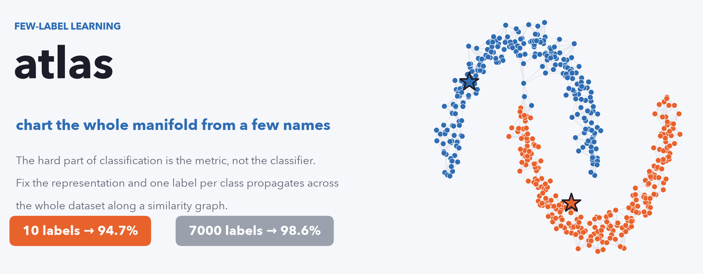</p>

# atlas

> **manifold üzerinde az-etiketli öğrenme** — *(English: [README.md](README.md))*

**Sınıf başına bir etiket MNIST'i %94.7 doğrulukla sınıflandırır.** Etiketler zekice olduğu için değil — çünkü zor kısım hiçbir zaman etiket değildi. İyi bir temsili sıradan bir graf-difüzyon kuralına ver, on etiket yedi bin etiketin işini görür. Kötü bir temsil koy, *tıpatıp aynı kural* %71'e çöker.

<p align="center">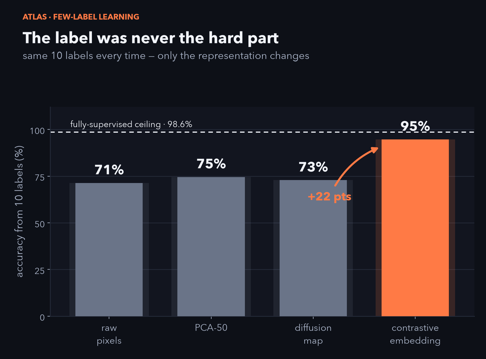</p>

Aradaki 23 puanlık farkın tamamı **metriktir** — hangi noktaların "yakın" sayıldığı. Etiket ise geometrinin zaten bulduğu bir kümeye yalnızca isim koyar. Bu repo bunu kesinleştirir, ölçer ve tam olarak nerede kırıldığını gösterir.

<p align="center">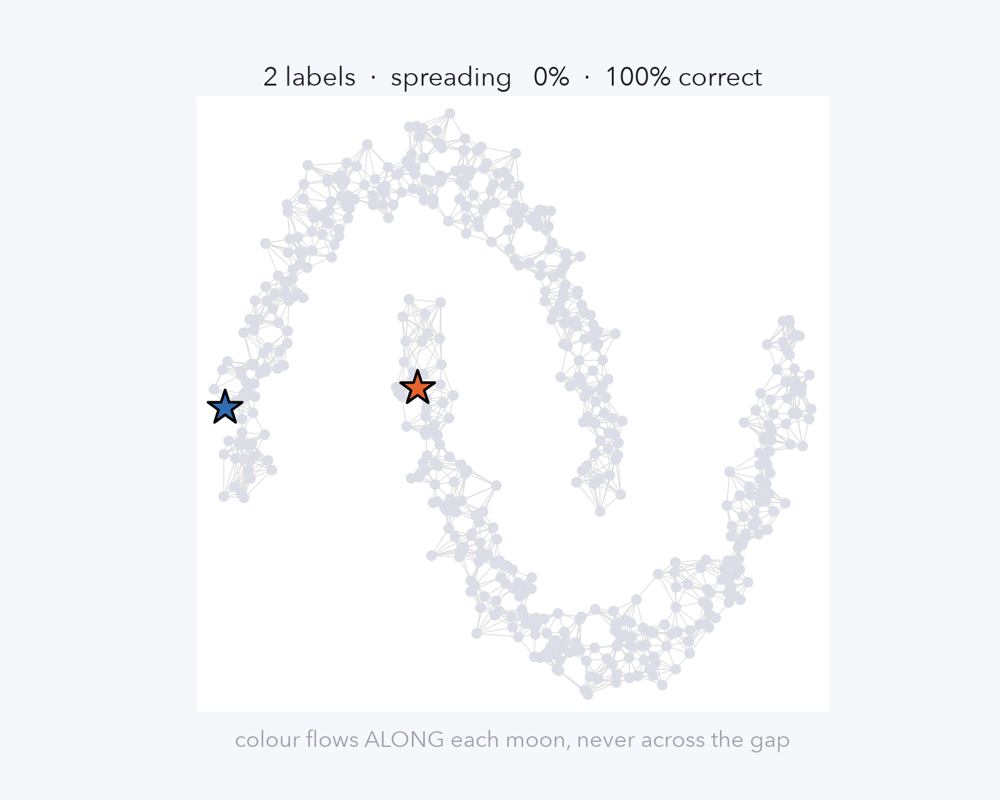</p>

---

## Üç iddia, her biri ölçülmüş

1. **Metrik her şeydir.** Aynı 10 etiket, aynı algoritma: ham piksel → %71, öğrenilmiş contrastive metrik → **%94.7** (tam-denetimli tavan: %98.6). Sınıflandırıcı değişmedi; geometri değişti.
2. **Etiketler sınıfları değil modları sayar.** Geometri veriyi grupladıktan sonra bir etiket, bir gruba verilen *isimden* ibarettir. Kabaca mod başına bir etiket gerekir ve sınıf, modların birleşimidir — yani etiket bütçesi kategori sayısını değil, verinin şeklini takip eder.
3. **Bu bir faz geçişidir, bir takas değil.** Keskin bir kenar-saflığı eşiği vardır. Üstünde tek etiket kümesini doğru boyar. Altında etiket yaymak *hiçbir şey yapmamaktan aktif olarak kötüdür*. Bu bir dipnot değil, taşıyıcı gerçek.

---

## Neden çalışır

**Öklid mesafesi manifoldda yalan söyler.** İki rakam piksel uzayında yakın ama farklı sınıflardan olabilir — çünkü aralarındaki düz çizgi iki katman arasındaki boşluğu keser. O metrikteki en-yakın-komşu, katmanların yaklaştığı her yerde yanılır.

<p align="center">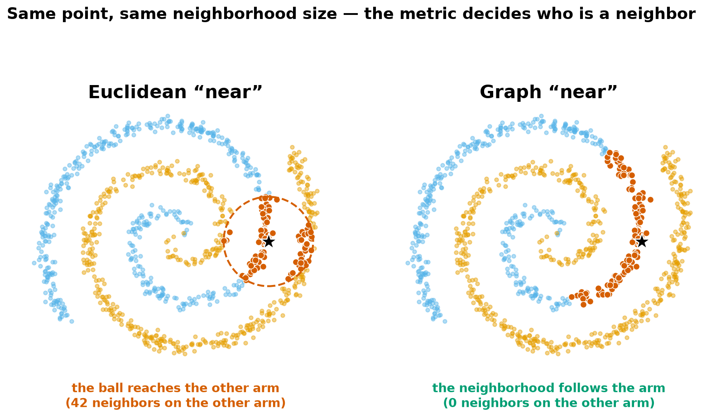</p>

**Graf metriği düzeltir.** Her noktayı k en yakın komşusuna bağla ve etiketin düz çizgide sıçraması yerine *kenarlar boyunca akmasına* izin ver. Artık "yakın" demek *veri boyunca ulaşılabilir* demektir. Sınıf başına tek tohumdan başlayan bu akış tüm veriyi boyar — yeter ki kenarlar çoğunlukla aynı sınıftan noktaları bağlasın. Her şeye karar veren tek sayı **kenar saflığıdır**.

---

## Mekanizma — matematiği

**Graf.** $n$ noktanın her birini bir $\phi$ temsiliyle göm, her noktayı $k$ en yakın komşusuna bağla, her kenarı Gauss çekirdeğiyle ağırlıklandır, simetrikleştir ($W=W^{\top}$) ve derece matrisi $D=\operatorname{diag}(\sum_j W_{ij})$ ile normalize et:

$$W_{ij} = \exp\!\left(-\frac{\lVert \phi_i-\phi_j\rVert^2}{2\sigma^2}\right),\qquad S = D^{-1/2}\,W\,D^{-1/2}.$$

**Etiket yayılımı.** Az sayıdaki etiketi bir one-hot tohum matrisi $Y$'ye koy (yalnız tohumlarda sıfırdan farklı) ve sabit noktaya kadar iterasyonla çalıştır:

$$F^{(t+1)} = \alpha\,S\,F^{(t)} + (1-\alpha)\,Y \;\;\xrightarrow{\;\alpha<1\;}\;\; F^{\star} = (1-\alpha)\,(I-\alpha S)^{-1}\,Y = (1-\alpha)\sum_{t=0}^{\infty}(\alpha S)^{t}\,Y,$$

sonra $\hat y_i=\arg\max_c F^{\star}_{ic}$ ile tahmin et. Asıl fikir bu seride: $(\alpha S)^{t}$, $t$-uzunluklu yürüyüş operatörüdür; yani bir noktanın etiketi ona **her uzunluktaki yürüyüşlerle ulaşan etiket kütlesinin iskontolu toplamıdır** — etiket kenarlar boyunca akar, kısa yürüyüşler en ağır. Eşdeğer olarak $F^\star$, şunun tek minimize edicisidir:

$$\tfrac12\sum_{i,j} W_{ij}\left\lVert \tfrac{F_i}{\sqrt{D_{ii}}}-\tfrac{F_j}{\sqrt{D_{jj}}}\right\rVert^2 \;+\; \tfrac{1-\alpha}{\alpha}\sum_i \lVert F_i-Y_i\rVert^2,$$

güçlü kenarlar boyunca yavaş değişen, tohumlara yakın kalan etiketler.

**Neden her şey saflıkta.** $S=S_{\text{iç}}+S_{\text{çapraz}}$ diye ayır (sınıf-içi ve çapraz kenarlar). Yürüyüş serisi tohumun etiketini $S_{\text{iç}}$ üzerinden doğru taşır; $S_{\text{çapraz}}$ içeren her terim, *yanlış* etiketi sınırın karşısına sızdıran bir kanaldır. Kenar saflığı $\pi=\tfrac{\text{sınıf-içi kenar ağırlığı}}{\text{toplam}}$ ile: $\pi\to1$ iken $S$ sınıflara göre blok-köşegen olur, difüzyon evinde kalır; $\pi$ düşerken çapraz iletkenlik büyür ve bir eşiği geçince bir düğümdeki yanlış-etiket kütlesi doğruyu aşar, $\arg\max$ **döner**. Uçurum, yokuş değil.

**$\pi$'yi yükselten temsil.** Contrastive kodlayıcı, **etiketsiz** eğitilerek, bir görüntünün iki artırımını yakınlaştırır, geri kalan her şeyi iter (NT-Xent, sıcaklık $\tau$):

$$\mathcal{L}_i = -\log\frac{\exp(\langle z_i,z_i^{+}\rangle/\tau)}{\sum_{j\ne i}\exp(\langle z_i,z_j\rangle/\tau)}.$$

Bu, metriği aynı-sınıf görüntüler komşu olacak şekilde büker; kenar saflığı %88'den (ham) %97'ye (contrastive) fırlar — faz geçişinin tam da ödüllendirdiği şey.

---

## Gerçek kılan yakalama: faz geçişi

Metriği boz, kenar saflığı düşer. Graf difüzyonu saflığı **dik** takip eder; naif 1-NN neredeyse kıpırdamaz. Bir kesişimin altında (MNIST'te ~%65 saflık) "akıllı" yöntem *temelden daha kötüdür* — tek bir ağır "köprü" kenarı koca bir bölgeyi yanlış etiketle sular.

<p align="center">
  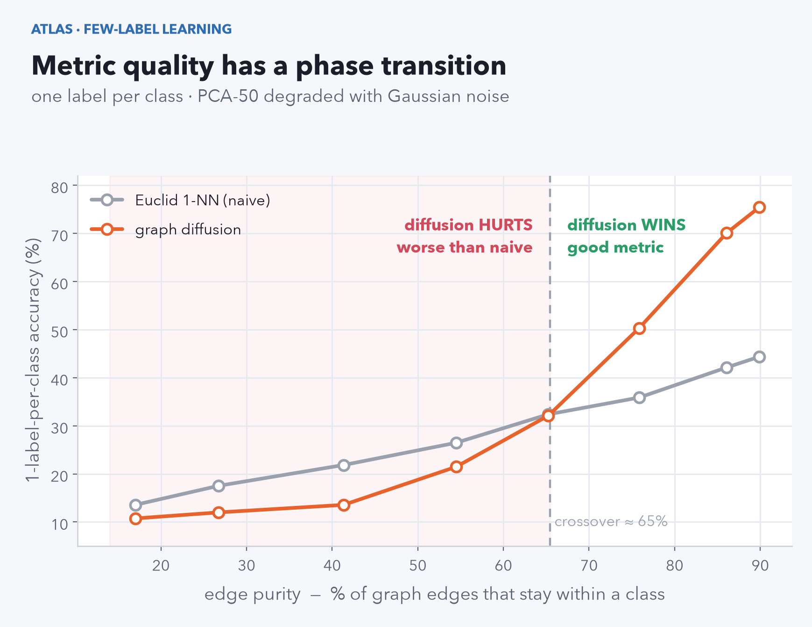
  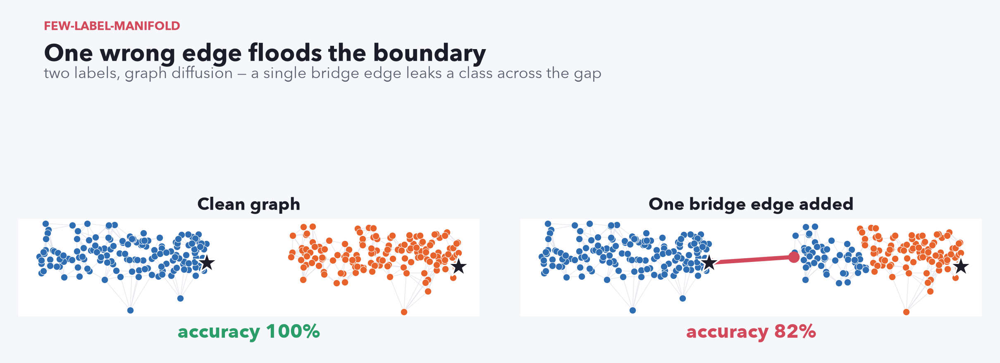
</p>

Sonucun işe yarar kısmı bu: *ne zaman uğraşmayacağını* söyler. Temsilin düşük-saflıklı bir graf veriyorsa, etiket yayılımı sana etiket kazandırmaz, doğruluk kaybettirir.

---

## Bir veri kümesi gerçekte kaç etiket ister?

Temsili $N$ kümeye ayır ve her birine bir etiket ver. $N$ büyüdükçe doğruluk küme-başı çoğunluk tavanına doğru tırmanır — doğruluğu *isimlerle* satın alıyorsun ve para birimi **modlar, sınıflar değil**. On etiket (sınıf başına bir), bu eğrinin sadece en kaba noktası.

<p align="center">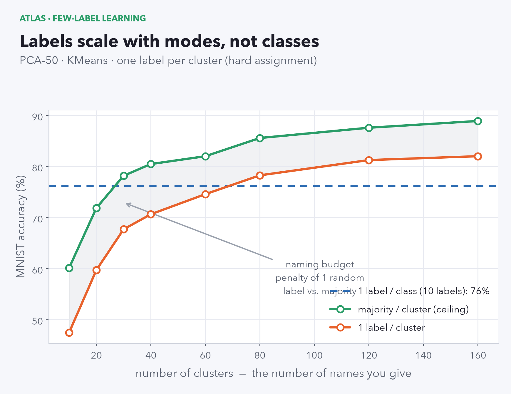</p>

---

## On etiket, haritanın üzerinde

Contrastive gömme; solda gerçek etiketlerle, sağda yalnızca 10 tohumdan difüze edilen etiketle (siyah yıldızlar; hatalar kırmızı). On isim, bütün harita.

<p align="center">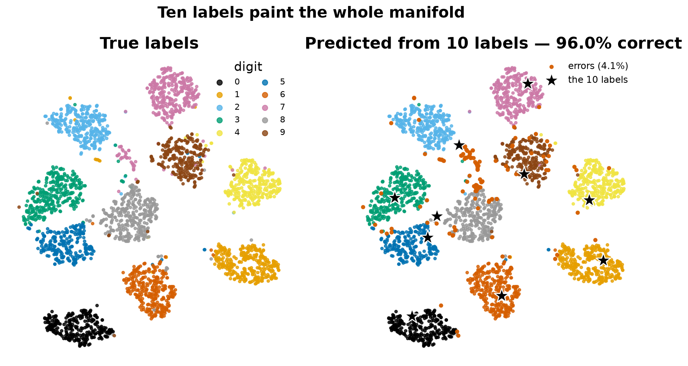</p>

---

## Yeniden üretim

```bash
pip install -r requirements.txt
python src/evaluate.py          # tablo               -> results/results.json
python src/sweep.py             # saflık + bütçe      -> results/sweep.json
python figures/make_figures.py  # tüm figürler (kapak GIF'i dahil)
```

Contrastive gömme ve değerlendirme bölmesi repoda gelir; her sayı **GPU olmadan** yeniden üretilir (MNIST ilk kullanımda kendini indirir). Kodlayıcıyı yeniden eğit: `pip install torch && python src/train_contrastive.py 40` (MPS / CUDA / CPU otomatik). 5 hücrelik tur: [`notebooks/demo.ipynb`](notebooks/demo.ipynb).

**Sayılar** (MNIST, 10k, sınıf başına 1 etiket, 60 seçim, k=10) — doğruluk kaynağı `results/*.json`:

| temsil | kenar saflığı | Öklid 1-NN | graf difüzyonu |
|---|--:|--:|--:|
| ham piksel | %88.4 | %42.3 | %71.4 |
| PCA-50 | %89.9 | %43.6 | %74.6 |
| difüzyon haritası | %91.3 | %37.6 | %72.8 |
| **contrastive** | **%96.6** | **%62.9** | **%94.7** |

---

## Gerçek fotoğraflarda tutuyor mu? — ImageNette

MNIST kolaydır. O yüzden dürüst test gerçek ImageNet fotoğrafları: [ImageNette](https://github.com/fastai/imagenette) (10 sınıf — tench, church, parachute, …), sıfırdan **etiketsiz** eğitilmiş bir ResNet-18 contrastive kodlayıcı (128px, 100 epoch), sonra 3925 görüntülük doğrulama havuzunda aynı sınıf-başına-1-etiket değerlendirmesi.

**Tez daha da güçleniyor.** Gerçek görüntülerde piksel metriği neredeyse işe yaramaz — ham-piksel difüzyonu şans seviyesinde (%13). Öğrenilmiş metrik %54'e sıçrar. Temsil farkı MNIST'teki +23 puandan burada **+39** puana çıkar.

<p align="center">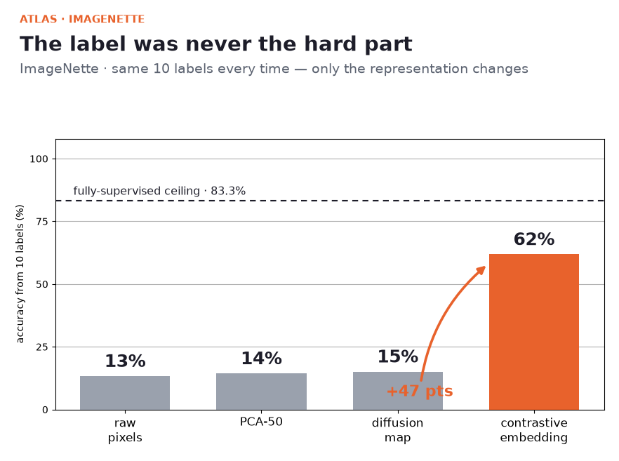</p>

| temsil | kenar saflığı | Öklid 1-NN | graf difüzyonu |
|---|--:|--:|--:|
| ham piksel | %21.1 | %15.4 | %13.3 |
| PCA-50 | %22.8 | %15.8 | %14.4 |
| difüzyon haritası | %21.5 | %13.1 | %15.1 |
| **contrastive (ResNet-18)** | **%69.8** | **%45.8** | **%54.1** |

**Ve faz geçişi aynı yerde.** Contrastive metriği gürültüyle boz, difüzyon naif 1-NN'in altına **~%62 kenar saflığında** iner — neredeyse MNIST eşiği (~%65). Saflık uçurumu veri kümesinin değil, *yöntemin* bir özelliği gibi.

<p align="center">
  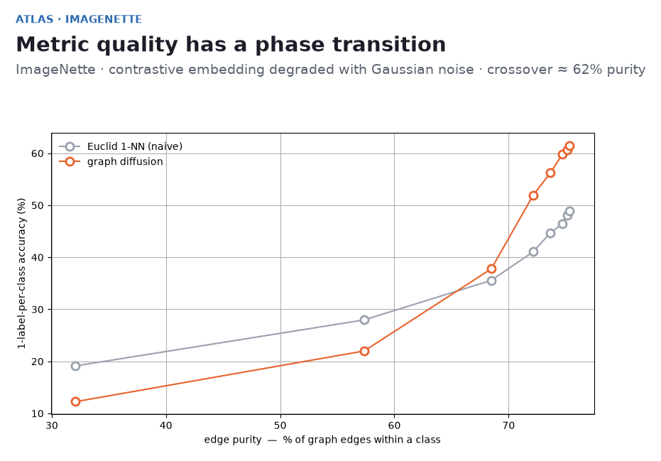
  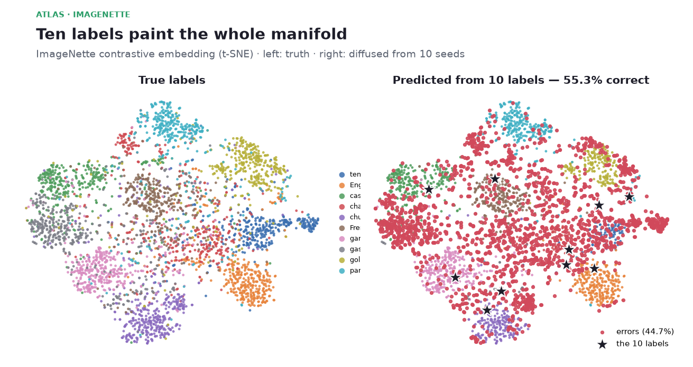
</p>

**Dürüst kapsam.** Az etiket **%54.1**'e ulaşır, tam-denetimli tavan **%77.5** (~2700 etiket) — tavanın ~%70'i, MNIST'in ~%96'sı değil. Bu boşluk etiketlerin değil, *temsilin* suçu: 9k görüntüde 100-epoch sıfırdan kodlayıcı mütevazı bir metriktir ve yukarıdaki barlar mütevazı bir metriğin on etiketi ne kadar taşıyabileceğini sınırladığını gösterir. Daha iyi kodlayıcı → ulaşılan tavan yükselir. Bütün mesele bu, yeniden ifade edilmiş hâli.

### MNIST'e karşı ImageNette (özet)

| | MNIST | ImageNette |
|---|--:|--:|
| ham-piksel (10 etiket) | %71.4 | %13.3 |
| contrastive (10 etiket) | %94.7 | %54.1 |
| **temsil farkı** | **+23 puan** | **+39 puan** |
| tam-etiket tavanı | %98.6 | %77.5 |
| tavanın yakalanan oranı | ~%96 | ~%70 |
| faz-geçişi eşiği | ~%65 saflık | ~%62 saflık |

```bash
python src/train_contrastive_imagenette.py --epochs 100 --img 128   # Apple GPU'da ~40 dk
python src/evaluate.py --dataset imagenette
python src/sweep.py --dataset imagenette && python figures/make_imagenette_figures.py
```

Eğitilmiş gömme (`data/imagenette_emb.npz`) repoda gelir; tablo ve figürler **GPU olmadan** yeniden üretilir. **Mac (MPS) ve NVIDIA (CUDA, RTX 50-serisi dahil) için tam kurulum — torch cu128 kurulumu, VRAM rehberi, önerilen config'ler, AMP — [`docs/TRAINING.md`](docs/TRAINING.md)'de** (cihaz otomatik seçilir; CUDA'da mixed-precision açık; daha çok kapasite için `--backbone resnet50`).

---

## Bu ne

Klasik bir primitifin temiz, dürüst bir **ölçümü** — yeni bir algoritma değil: etiket yayılımı Zhou ve ark. (2004), difüzyon haritaları Coifman & Lafon (2006). atlas'ın kattığı şey, iki okunabilir veri kümesinde anatomisi — kenar-saflığı faz geçişi (MNIST *ve* ImageNette'te aynı ~%60-65 eşik), temsil-her-şeydir farkı ve modlar-sınıflar-değil etiket yasası — her biri tek komutla üretilir. MIT lisanslı.
