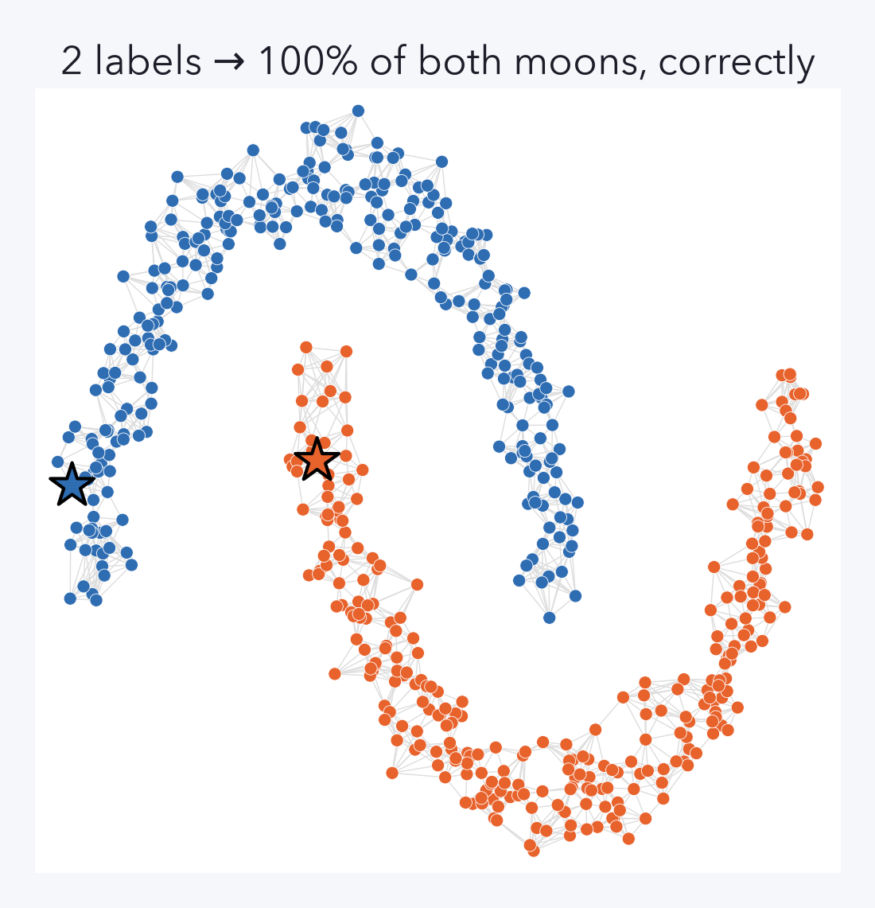

<p align="center"></p>

# few-label-manifold

**Yeterince iyi bir temsille, sınıf başına bir etiket 7000 etiketin getirdiğinin ~%95'ini verir — ve kötü bir temsille aynı numara hiçbir şey yapmamaktan *daha kötü* olur.**

*(English: [README.md](README.md))*

<p align="center"></p>

Sınıflandırmanın zor kısmı sınıflandırıcı değildir. **Metriktir** — hangi noktaların birbirine "yakın" sayılacağına nasıl karar verdiğindir. Metriği düzeltirsen etiketler neredeyse bedava olur: artık makineye bir rakamın ne olduğunu *öğretmiyorsun*, onun zaten bulduğu kümelere sadece *isim veriyorsun*.

---

## Fikir

**Öklid mesafesi neden yetmez.** Gerçek veride sınıflar eğri, iç içe geçmiş manifoldlarda yaşar. İki nokta düz-çizgi (piksel) mesafesinde yakın olabilir ama farklı sınıflara ait olabilir — çünkü düz çizgi manifoldun iki katmanı arasındaki boşluğu keser. Bu metrikteki bir en-yakın-komşu kuralı, katmanların yaklaştığı her yerde yanılır.

<p align="center"></p>

**Graf ne yapar.** Bir k-en-yakın-komşu grafı kur ve etiketin düz çizgide sıçraması yerine *kenarlar boyunca akmasına* izin ver. Artık "yakın" demek *veri boyunca ulaşılabilir* demektir; etiket bir katmanın içine yayılır ve boşlukta durur. Sınıf başına tek bir etiketli noktadan başlayarak bu graf difüzyonu neredeyse tüm veriyi boyar — **eğer** grafın kenarları çoğunlukla aynı sınıftan noktaları bağlıyorsa. Başarıyı öngören tek sayı **kenar saflığıdır**: bir sınıf içinde kalan kenarların oranı.

<p align="center"></p>

**Etiket neden yalnızca *isim verir*.** Temsil veriyi zaten gruplamışsa, bir etiket sınıfı oyup çıkarmaz — geometrinin kendiliğinden bulduğu bir gruba yalnızca insan-okunur bir ad ekler. Yani ihtiyacın olan etiket sayısı, sınıf sayısıyla değil, verideki **mod** (ayrı yığın) sayısıyla ölçeklenir.

---

## Nasıl çalışır — matematiği

**Graf.** $n$ noktanın her birini bir $\phi$ temsiliyle göm, her noktayı $k$ en yakın komşusuna bağla ve her kenarı Gauss çekirdeğiyle ağırlıklandır

$$W_{ij} = \exp\!\left(-\frac{\lVert \phi_i-\phi_j\rVert^2}{2\sigma^2}\right),\qquad \sigma=\text{medyan kenar uzaklığı},$$

$W=W^{\top}$ olacak şekilde simetrikleştir. Derece matrisi $D=\operatorname{diag}(\sum_j W_{ij})$ ile simetrik normalize operatörü kur:

$$S = D^{-1/2}\,W\,D^{-1/2}.$$

**Etiket yayılımı (label spreading).** Çok az etiketi bir one-hot tohum matrisine koy: $Y\in\{0,1\}^{n\times C}$, yalnız etiketli tohumlarda sıfırdan farklı. Şunu iterasyonla çalıştır

$$F^{(t+1)} = \alpha\,S\,F^{(t)} + (1-\alpha)\,Y,\qquad \alpha\in(0,1),$$

ve $\hat y_i=\arg\max_c F_{ic}$ ile tahmin et. $\lVert \alpha S\rVert_2=\alpha<1$ olduğundan bu bir büzülme (contraction) ve kapalı forma yakınsar:

$$F^{\star} = (1-\alpha)\,(I-\alpha S)^{-1}\,Y = (1-\alpha)\sum_{t=0}^{\infty}(\alpha S)^{t}\,Y.$$

**Neden difüzyon.** Asıl fikir bu seride: $(\alpha S)^{t}$, graf üzerinde $t$-uzunluklu yürüyüş operatörüdür, $\alpha^{t}$ ile iskontolanmış. Yani bir noktanın etiketi, ona **her uzunluktaki graf yürüyüşleriyle ulaşan etiket kütlesinin iskontolu toplamıdır** (kısa yürüyüşler en ağır) — etiket *kenarlar boyunca* akar; "yakın" demek düz-çizgi değil, *veri boyunca ulaşılabilir* demektir. Eşdeğer olarak $F^{\star}$ şunu minimize eder:

$$\tfrac12\sum_{i,j} W_{ij}\left\lVert \tfrac{F_i}{\sqrt{D_{ii}}}-\tfrac{F_j}{\sqrt{D_{jj}}}\right\rVert^2 \;+\; \tfrac{1-\alpha}{\alpha}\sum_i \lVert F_i-Y_i\rVert^2,$$

yani *etiketler güçlü kenarlar boyunca yavaş değişir*, tohumlara yakın kalırken.

**Neden her şey kenar saflığında.** $S=S_{\text{iç}}+S_{\text{çapraz}}$ diye ayır (sınıf-içi ve sınıflar-arası kenarlar). Yürüyüş serisi bir tohumun etiketini $S_{\text{iç}}$ üzerinden doğru taşır; $S_{\text{çapraz}}$ içeren her terim, *yanlış* etiketi sınırın karşısına sızdıran bir kanaldır. **Kenar saflığı**:

$$\pi=\frac{\text{sınıf-içi kenar ağırlığı}}{\text{toplam kenar ağırlığı}}.$$

$\pi\to1$ iken $S$ neredeyse sınıflara göre blok-köşegen olur, difüzyon sınıf-içinde kalır. $\pi$ düşerken çapraz iletkenlik büyür ve bir eşiği geçince bir düğüme ulaşan yanlış-etiket kütlesi doğru-etiketi aşar, $\arg\max$ **döner**. İşte bu yüzden doğruluk eğrisi yumuşak bir iniş değil, bir *faz geçişidir* (fig4) ve tek bir ağır köprü kenarı bir bölgeyi çevirebilir (fig3).

**Naif temel.** Öklid 1-NN, $\hat y_i = y_{\,i\text{'ye en yakın tohum}}$ der (ortam metriğinde): *tek* bir noktaya bakar ve ham mesafeye güvenir, o yüzden manifoldun katlandığı her yerde kırılır (fig1). Difüzyon ise tüm graf üzerinden toplar — $\pi$ yüksekken güç, düşükken zayıflık. Kesişim bu yüzden.

**$\pi$'yi yükselten temsil.** Contrastive kodlayıcı **etiketsiz** eğitilir: aynı görüntünün iki artırımını yakınlaştırır, geri kalan her şeyi iter (NT-Xent, sıcaklık $\tau$):

$$\mathcal{L}_i = -\log\frac{\exp(\langle z_i,z_i^{+}\rangle/\tau)}{\sum_{j\ne i}\exp(\langle z_i,z_j\rangle/\tau)}.$$

Bu, metriği aynı-sınıf görüntüler komşu olacak şekilde büker; kenar saflığı fırlar (ham piksel $\%88\to$ contrastive $\%97$) — faz geçişinin tam da ödüllendirdiği şey.

**Neden etiketler modlarla ölçeklenir, sınıflarla değil.** Difüzyon her saf bağlı bileşeni, içine düşen tohumun etiketiyle boyar; **tohumsuz** bir bileşen belirsizdir. Veri $M$ iyi-ayrık moddan oluşuyorsa, her şeyi boyamak için mod başına $\gtrsim 1$ tohum gerekir. Sınıf, modların *birleşimi* olduğundan etiket bütçesi sınıf sayısı $C$ ile değil, $M\ge C$ ile ölçeklenir (fig5).

> **Difüzyon haritaları** (tablo satırlarından biri) *aynı* operatörü farklı kullanır: $S$'in en büyük özvektörlerini al, özdeğerleriyle ölçekle ve bunları koordinat yap. Oradaki Öklid mesafesi grafın *difüzyon mesafesine* eşittir — bir sınıflandırıcı değil, bir temsil.

---

## Sonuçlar

MNIST, 10 000 değerlendirme rakamı, **sınıf başına bir etiket**, 60 rastgele seçim, k = 10.

| temsil | kenar saflığı | Öklid 1-NN | graf difüzyonu |
|---|--:|--:|--:|
| ham piksel | %88.4 | %42.3 | %71.4 |
| PCA-50 | %89.9 | %43.6 | %74.6 |
| difüzyon haritası | %91.3 | %37.6 | %72.8 |
| **contrastive (40 ep)** | **%96.6** | **%62.9** | **%94.7** |

Tam-etiketli lineer tavan (≈7000 etiket): **%98.6**.
Yani **10 etiket → %94.7**, **7000 etiket → %98.6**: 700× daha az etiket, 3.9 puan aşağıda.

İki şey göze çarpıyor. Difüzyon, naif en-yakın-komşuyu *yalnızca* yüksek-saflıklı grafta büyük farkla yener (contrastive: %94.7'ye karşı %62.9). Ve iğneyi oynatan şey etiket bütçesi değil, temsildir.

### Faz geçişi

Metriği boz (PCA-50'ye gürültü ekle), kenar saflığı düşer. Graf difüzyonu saflığı *dik* takip eder; Öklid-1NN neredeyse kıpırdamaz. Bir kesişimin altında (burada ~%65 saflık) "akıllı" yöntem naif temelden **daha kötü** çalışır.

<p align="center"></p>

### Etiketler modlarla ölçeklenir, sınıflarla değil

PCA-50'yi *N* kümeye ayır ve her birine **bir** etiket ver. *N* büyüdükçe doğruluk, küme-başı çoğunluk tavanına doğru tırmanır — doğruluğu *isimlerle* satın alıyorsun ve para birimi sınıflar değil modlardır.

<p align="center"></p>

### On etiket, haritanın üzerinde

Solda: contrastive gömme, gerçek etiketlerle renklendirilmiş. Sağda: yalnızca **10 tohumdan** (siyah yıldızlar) difüzyonla üretilen etiket; hatalar kırmızı.

<p align="center"></p>

---

## Ne zaman **çalışmaz**

Bu, önemli yarısı — o yüzden gizlenmedi:

- **Saflık eşiğinin altında, manifold yöntemi aktif olarak zarar verir.** Tek bir kötü ("köprü") kenar, bir etiketin sınıf sınırının karşısına taşmasına izin verir; yeterince olursa difüzyon grafı yok saymaktan *daha kötü* olur (faz-geçişi figürüne ve `figures/fig3_bridge_edge.png`'ye bak: tek kenar bir oyuncak problemi %100'den %82'ye düşürüyor). Temsilin düşük-saflıklı bir graf veriyorsa graf difüzyonuna sarılma.
- **Transdüktiftir.** Etiket, elindeki *sabit* bir etiketsiz nokta kümesine yayılır. Gerçekten yeni bir noktayı sınıflamak grafı yeniden kurmak/genişletmek demektir — bu, gönderip tek örnekle çağırabileceğin eğitilmiş bir model değildir.
- **Etiketler modlarla ölçeklenir, sınıflarla değil.** Bir sınıf çok-modluysa (birçok ayrı alt-küme), *sınıf* başına bir etiket çoğu modu kaçırır. Kabaca *mod* başına bir etiğe ihtiyacın var; modları bulmak da yine kümeleme problemidir.
- **Bu sayılar bir liderlik tablosundan değil, bu pipeline'dan.** Seed'e, k'ye ve tam grafa bağlıdır. Bir satır özgün bulut koşusundan farklı çıktı: *difüzyon-haritası* Öklid-1NN burada %46.6 yerine **%37.6** oldu (difüzyon-haritası gömmesinin ölçeklemesi yerel 1-NN'i çok değiştirir). Her şey aşağıdaki scriptlerle ölçülür; metni değil, `results/*.json`'u doğruluk kaynağı say.

<p align="center"></p>

---

## Çalıştırma

```bash
pip install -r requirements.txt
python src/evaluate.py          # başlık tablosu -> results/results.json
python src/sweep.py             # saflık süpürmesi + etiket bütçesi -> results/sweep.json
python figures/make_figures.py  # tüm figürleri yeniden üret (kapak GIF'i dahil)
```

Contrastive gömme (`contrastive_emb.npz`) ve değerlendirme bölmesi repoda gelir; başlık **GPU olmadan** yeniden üretilir. MNIST'in kendisi (21 MB) ilk kullanımda indirilir. Kodlayıcıyı sıfırdan yeniden eğitmek için (Apple-Silicon / CUDA / CPU otomatik):

```bash
pip install torch
python src/train_contrastive.py 40
```

5 hücrelik gezinti: [`notebooks/demo.ipynb`](notebooks/demo.ipynb).

---

## İlgili çalışmalar

- **Zhu, Ghahramani & Lafferty (2003)** — Gauss alanları / harmonik fonksiyonlarla yarı-denetimli öğrenme. Bu reponun difüze ettiği etiket-yayılım amacı; burada *ne zaman* çalıştığının, kenar saflığı etrafında kurulmuş bir gösterimi.
- **Zhou, Bousquet, Lal, Weston & Schölkopf (2004)** — "Local and global consistency" (label spreading). `src/metrics.py`'deki tam normalize-Laplace iterasyonu; bu repo onu önermek yerine kırılma noktasına kadar zorlar.
- **Coifman & Lafon (2006)** — diffusion maps. Burada bir *temsil* olarak kullanılır ("difüzyon haritası" tablo satırı), sınıflandırıcı olarak değil.
- **Douze, Szlam, Hariharan & Jégou (2018)** — düşük-örnekli öğrenme için büyük-ölçekli etiket yayılımı. Aynı fikir ImageNet ölçeğinde öğrenilmiş özniteliklerle; bu repo, sınıf-başına-tek-etiket rejimini ve saflık faz geçişini küçük, okunabilir bir veri kümesinde yalıtır.
- **Google Expander** — devasa graflarda üretim-düzeyi etiket yayılımı. Aynı primitifin endüstriyel mühendisliği; bu repo onun 200 satırlık pedagojik zıttı, fikrin sınırına odaklı.

## Lisans

MIT — bkz. [LICENSE](LICENSE).
